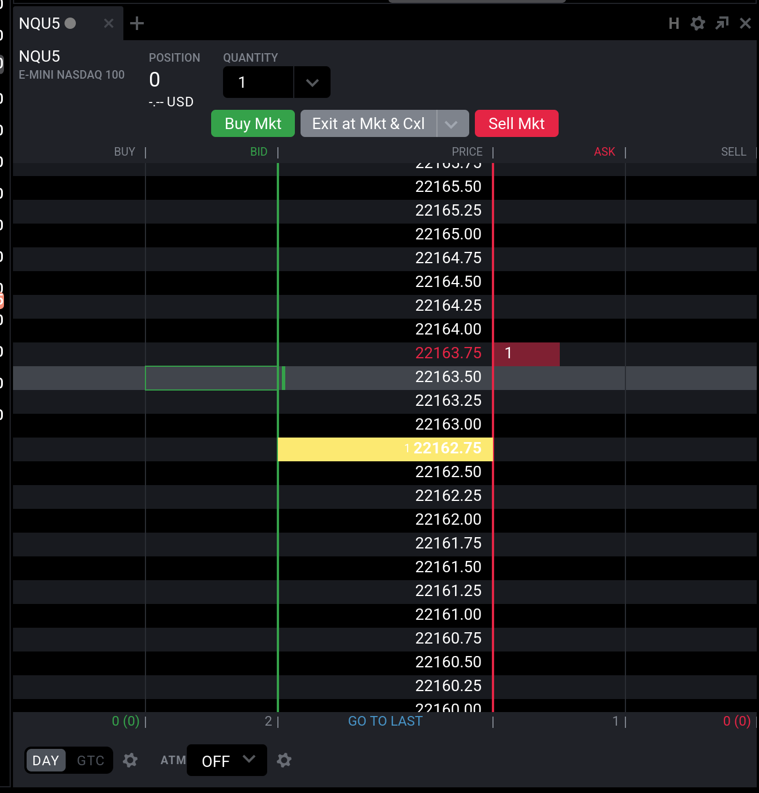

# dndw: order flow and stop hunts

## part 1: the order book and market drivers

The <r>order book</r> is the instrument that drives a financial market. It basically is the record of all <bl>currently
working buy and sell orders</bl> at any given time.

A <r>maker</r> refers to a person who <bl>has a working order</bl> in the order book. The <r>taker</r> is the person
that <bl>executes that order</bl> by buying or selling at the price specified. This pair is referred to as a party and
the counter-party.

### how orders drive the market

If you're a retail trader, you might think that there are <r>3 main types of orders</r>. But in actuality, there are
</bl>only two types</bl> of orders: market and limit orders.

<bl>Limit orders</bl> are simple to understand. You place an order <r>at a specific price</r>. The order will
<r>only be filled</r> at or better than that price.

<bl>Market orders</bl> are even better to understand. Buy orders <r>execute on the lowest working</r> sell order and
sell orders <r>execute on the highest working</r> buy order.

<r>Stop orders</r> are basically <bl>market orders in disguise</bl>. The mechanism of a stop order
<r>**never goes into the order book**</r>. Stop orders are acted on <bl>by the broker</bl> when the price falls to a
<r>specific level</r>, where a <bl>**market order**</bl> is executed at that price.

### how liquidity drives the market

<bl>Liquidity</bl> is the <r>primary driving factor</r> behind the <bl>movement of price</bl> in a financial market.
<bl>Liquidity</bl> is defined as the <r>ease</r> in which one can <bl>enter and exit</bl> a position
<r>without affecting the price</r>.

The <r>primary liquidity provider</r> in most financial markets come in the form of <bl>*working orders*</bl>.
Logically speaking, if there are <r>more orders at a price</r>, there needs to be <bl>more executions</bl> at that
price in order to move the market. <y>More executions to move = more liquidity</y>.

We can also use language such as <r>resting liquidity</r> to refer to <bl>"dormant" limit orders</bl> and
<r>aggressive liquidity</r> to refer to <bl>market orders</bl> that "take out" the resting liquidity.

<description>~~Depth of Market (DOM) is a common tool used to visualize the order book.</description>

### smart money theory

<r>Smart money</r> refers to the <bl>big institutional traders</bl>. Think <r>banks</r> and <r>hedge funds</r> that have
<bl>hundreds of billions</bl>. Whenever they want to <bl>enter long</bl>, they <r>can't simply press "Buy"</r> because
that would <r>explode their average order price</r> (and their subsequent total loss) into the moon.
They have to <bl>look for areas with more liquidity</bl> so that they can actually enter with a <bl>good fill price</bl>.

## part 2: stop hunts

<r>Stop hunts</r> refers to a trading strategy where smart money <bl>moves the market</bl> to an area with
<r>pending stop orders</r> to create enough liquidity.

This definition is also <r>**wrong**</r>.

### the mechanism of stop hunts

The <bl>idea</bl> behind a stop hunt is <bl>correct</bl>. Institutional traders need to <r>create liquidity</r> for
themselves, so they do so by <bl>sending price</bl> to an area with a lot of <bl>pending orders</bl>.

However, there are <r>main distinctions</r> to be made from the commonly accepted definition, and that comes with
<bl>understanding how institutions enter trades</bl>.

Specifically, those institutional traders place several <bl>limit orders</bl> to enter their trade,
and <r>similar orders</r> to exit.

So the liquidity that stop hunts are going for isn't the <r>retail trader stop orders</r>, it's the institutions'
<bl>own resting liquidity</bl>, and other traders act as the <r>aggressive liquidity</r> that <bl>fill those orders</bl>.

**The smart money <r>isn't sweeping liquidity</r>, they <bl>are the liquidity</bl>.**

Notably, the <r>primary aggressive liquidity</r> is <bl>other institutions</bl>, primarily high frequency trading firms.

## day trading ~ fighting the bank??
This is something I hear <r>A LOT</r>. But you, as a retail trader, should <r>never be trying to against the bank</r>.
You're never going to win.

And guess what? The bank <r>doesn't care about you either</r>. You fill a percentage of their order <bl>so small</bl>
that it's basically a <bl>rounding error</bl>. The banks are basically <y>fighting against other banks</y>.

With that in mind, <r>YOU</r>, the humble <bl>"little-guy" retail trader</bl>, gets to <y>decide</y> whether you want
to be <bl>WITH the banks</bl> or <r>AGAINST the banks</r>.

I don't know about you, but the <bl>former</bl> sounds <r>a lot better</r> for my bank account.